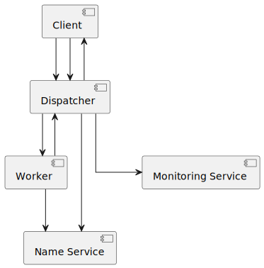
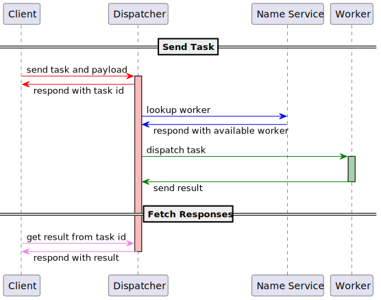

# Verteilte Systeme Prüfungsaufgabe

## Kommunikationsprotokoll

Das Kommunikationsprotokoll definiert drei Rollen: den NameServer, Dispatcher und Worker. Diese sind wie folgt definiert. Eine `message` ist eine Datenstruktur, die bei einem RPC-Aufruf übertragen werden kann. Ein `service` ist eine Schnittstellenbeschreibung und `rpc` definiert die einzigen Prozeduren, die aufgerufen werden können.

```protobuf
syntax = "proto3";

import "google/rpc/status.proto";
import "google/protobuf/wrappers.proto";
import "google/protobuf/empty.proto";

package services;

message Task {
    uint32 task_id = 1;
    repeated string payload = 3;
}

message TaskResult {
    uint32 task_id = 1;
    repeated string payload = 2;
    bool valid = 3;
};

message ServiceIPWithPort {
    string ip = 1;
    uint32 port = 2;
}

message ExecuteTaskRequest {
    string type = 1;
    repeated string payload = 2;
}

message Service {
    string name = 1;
    services.ServiceIPWithPort address = 2;
}

message WorkerStatus {
    string usage = 1;
    optional google.rpc.Status status = 2;
}

service Dispatch {
    rpc execute(services.ExecuteTaskRequest) returns (google.protobuf.UInt32Value) {}
    rpc get_task_result(google.protobuf.UInt32Value) returns (services.TaskResult) {}        
    rpc delete_task_result(google.protobuf.UInt32Value) returns (google.protobuf.Empty) {}
    rpc return_result(services.TaskResult) returns (google.protobuf.Empty) {}
}

service NameService {
    rpc register(Service) returns (google.protobuf.Empty) {}
    rpc unregister(google.protobuf.StringValue) returns (google.protobuf.Empty) {}
    rpc lookup(google.protobuf.StringValue) returns (services.ServiceIPWithPort) {}
}

service Worker {
    rpc receive_task(services.Task) returns (google.protobuf.Empty) {}
    rpc get_status(google.protobuf.Empty) returns (WorkerStatus) {}
}
```
- **message Task**: Beschreibt einen Task, den der Dispatcher an den Worker schickt. `task_id` enthält die vom Dispatcher diesem Task zugewiesene ID und `payload` die vom Client an den Dispatcher übergebenen Argumente.
- **message TaskResult**: Enthält das Ergebnis eines Tasks. `task_id` ist die ID für den Task, die der Dispatcher diesem Task zugeordnet hat. Es können über `payload` mehrere Werte zurückgegeben werden. Das Feld `valid` beschreibt, ob das Ergebnis verwendet werden kann, oder ob es bei der Verarbeitung Fehler gab und die `payload` ignoriert werden soll.

- **message ServiceIPWithPort**: Enthält die Informationen mit denen der NameService einen anderen Dienst basierend auf seinem Namen identifiziert. `ip` ist die IP des Services und `port` der Port des Services auf den gehorcht wird.

- **message ExecuteTaskRequest**: Diese Nachricht wird an den Dispatcher geschickt, um die Ausführung eines Tasks anzufragen. `type` enthält den Aufgaben-Typ des Tasks (bspw. `sum`, `strlen`, ...) und `payload` die zu verarbeitenden Daten für den Task.

- **message Service**: Enthält die Daten mit denen ein Service beim NameService identifiziert ist. `name` ist der hinterlegte Name beim NameService und `address` die Verbindungsdaten für den Service.

- **message WorkerStatus**: Gibt den aktuellen Status des Workers zurück. `usage` enthält eine an Menschen gerichtete Beschreibung der erwarteten Eingaben und Ausgaben des Workers. `status` enthält optional einen Status, wenn der Worker sich in einem Fehlerhaften zustand befindet.

---
- **Dispatch::execute**: Der Client fordert vom Dispatcher die Ausführung des Tasks `services.ExecuteTaskRequest` an.
- **Dispatch::get_task_result**: Der Client fordert das Ergebnis vom Dispatcher für den Task mit einer bestimmten Task ID an.
- **Dispatch::delete_task_result**: Der Client bittet den Dispatcher, das Ergebnis für den Task mit einer bestimmten ID zu löschen.
- **Dispatch::return_result**: Ein Worker gibt das Ergebnis für einen bearbeiteten Task an den Dispatcher zurück.
---  
- **NameService::register**: Ein Service, wie ein Worker oder der Dispatcher, nutzt diese Prozedur, um sich beim NameService mit einem bestimmten Namen anzumelden
- **NameService::unregister**: Ein Service, wie ein Worker oder der Dispatcher, nutzt diese Funktion, um sich beim NameService mit seinem Namen abzumelden
- **NameService::lookup**: Diese Prozedur kann genutzt werden, um für den Namen eines Workers, die Addresse dieses Workers zu finden.
---
- **Worker::receive_task**: Der Dispatcher sendet über diese Prozedur einen neuen Task an den Worker. Der Task ist über die Message `services.Task` beschrieben, genauer, dessen durch den Dispatcher bestimmte ID und die Argumente (`payload`).
- **Worker::get_status**: Bei einem zustandshaften Worker, kann diese Prozedur aktuelle Informationen über den Zustand des Workers liefern. Bei uns wird diese Methode auch genutzt, um dem Nutzer Informationen über die Nutzung des Workers zu liefern (bspw. die erwarteten Argumente).

## Build Prozess

Um die RPC-Schnittstellen zu generieren muss der Befehl `make` im Root-Verzeichnis des Projektes ausgeführt werden.
  
Um die Docker-Images zu bauen, muss im Root-Verzeichnis die `docker_test_script.sh` ausgeführt werden.

## Ausführung mit Docker

Das verwendete docker script und die [docker-compose.yaml](docker-compose.yml) wurden nur auf Linux und MacOS erfolgreich getestet,
somit kann keine Windows kompatibilität garantiert werden (da es auf Windows manchmal zu Problemen mit docker networks kommen kann).

Das Repo enthält alle Teile der Prüfungsleistung. Da diese in verteilten Dockerkontainern laufen sollen, kann man nicht
nur ein **Dockerfile** wie gewohnt bauen und ausführen. Die **Dockerfiles** befinden sich im Ordner 
[dockerfiles](./dockerfiles) sie müssen jedoch aus dem Wurzelverzeichnis gebaut werden (da dockers *COPY* Befehl nicht
außerhalb des contexts operieren kann). Um diese zu bauen, sollte das script [docker_test_script.sh](docker_test_script.sh)
verwendet werden.
Anschließend lassen sich die container mit der [docker-compose](docker-compose.yml) mit dem Befehl `docker compose up`
ausführen. 

Um die container im Hintergrund auszuführen wird `docker compose up -d` verwendet und um diese wieder zu beenden
und die Container aufzuräumen: `docker compose down --remove-orphans`.

### Gemeinsame Logs
Die Container schreiben ihre logs in dem gemeinsamen Volume `/logs`. Man kann diese einsehen, indem man es aus einem
beliebigen Container kopiert beispielsweise mit `docker cp nameserver:/logs ./logs-nameserver`.

## Ausführung lokal
Um die lokale Ausführung zu testen kann einfach das [test Script](test_script.bash) verwendet werden.

Die Datei [main.py](./main.py) dient als Einstiegspunkt für alle Teile des Systems. Voraussetzungen sind eine aktuelle Version
von python und poetry insatlliert zu haben. Die nötigen Dependencies können ganz einfach mit```poetry install``` installiert werden.
Um alles ausführen zu können muss zunächst der **nameserver** gestartet werden, dies muss im poetry environment stattfinden.
Anschließend kann man den dispatcher, worker und den client starten. Folgende Befehler sind notwenig um alle Services
lokal auszuführen (mit der default Portwahl, welche mit angabe des Ports überschrieben werden kann):
~~~shell
poetry run python3 main.py nameserver
~~~
~~~shell
poetry run python3 main.py dispatcher
~~~
Um den Worker zu starten wird die Angabe der Aufgabe, für die der Worker zuständig sein soll, sowie der 
Dispatcher Adresse benötigt. Die unterstützten Aufgaben sind:
* sum (Summiert 2 übergebene Zahlen)
* hash (md5 hash des übergebenen Strings)
* reverse (Gibt Eingabestring von rechts nach links zurück)
* strlen (Gibt die Längen der Eingabestrings zurück)
* floor (Gibt den Integer Teil einer Dezimalzahl zurück)
* softmax (Wendet die softmax Funktion auf die Eingabezahlen an)
~~~shell
poetry run python3 main.py worker {task} localhost:50052
~~~
Um die Funktionen als client zu testen kann man die folgende Funktion nutzen.
~~~shell
poetry run python main.py exec {task} {args}
~~~

## Ablaufdiagramm
Das System besteht aus den folgenden Komponenten:



Das Ablaufdiagramm zu den Interaktionen zwischen diesen Komponenten sieht wie folgt aus:



## Beschreibung der Verwendeten Externen Bibliotheken und deren Funktionalität
- [gRPC](https://github.com/grpc/grpc) ist eine Bibliothek, welche [Protobuf](https://protobuf.dev/) verwendet, um RPC-Dienste umzusetzen. Aus dem [README.md](https://github.com/grpc/grpc/blob/master/README.md) des Projektes:

    ```
    gRPC is a modern, open source, high-performance remote procedure call (RPC) framework that can run anywhere. gRPC enables client and server applications to communicate transparently, and simplifies the building of connected systems.
    ```
  
- [Python Fire](github.com/google/python-fire) ist eine Bibliothek, um schnell und einfach Command Line Interfaces in Python umzusetzen. Aus em [README.md](https://github.com/google/python-fire/blob/master/README.md):
    ```
    Python Fire is a library for automatically generating command line interfaces (CLIs) from absolutely any Python object.

    Python Fire is a simple way to create a CLI in Python.
    Python Fire is a helpful tool for developing and debugging Python code.
    Python Fire helps with exploring existing code or turning other people's code into a CLI.
    Python Fire makes transitioning between Bash and Python easier.
    Python Fire makes using a Python REPL easier by setting up the REPL with the modules and variables you'll need already imported and created.
    ```


## Auflistung verwendeter Technologien
- [gRPC](https://github.com/grpc/grpc)
- [Protobuf](https://protobuf.dev/)
- [Python Fire](github.com/google/python-fire)